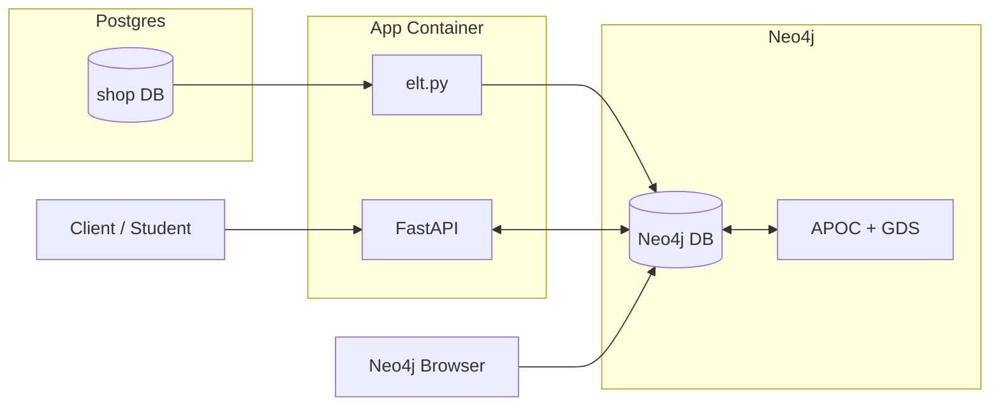

# Graph Database TP2 - E-Commerce Graph Recommendations with Postgres, Neo4j, and Python

## Overview

In this exercise, we’ll build a **realistic e-commerce recommendation engine** using:

* **PostgreSQL** for transactional data storage
* **Neo4j** for graph analytics & recommendations
* **Python (FastAPI)** for the API layer
* **Docker Compose** to run it all

You will:

1. **Load e-commerce dataset** (Olist subset + synthetic events)
2. **Run an ETL** to transform relational data into a graph
3. **Write and run graph algorithms** (co-occurrence, similarity, PageRank... )
4. **Expose recommendations** via an API
5. **Test and compare results**

This mirrors a **production use case** in many companies:

> Data from an relational database (Postgres) is periodically ETL into a graph database (Neo4j) to power recommendations and customer insights.

---

Your mission will be to implement the following architecture 🫡

## 🗂 Repository Structure

```
.
├── docker-compose.yml
├── postgres/
│   └── init/
│       ├── 01_schema.sql
│       ├── 02_seed.sql
├── neo4j/
│   ├── data/         # persisted DB files
│   └── import/       # CSVs for direct Neo4j LOAD CSV 
├── app/
│   ├── main.py       # FastAPI app
│   ├── etl.py        # ETL from Postgres -> Neo4j
│   ├── queries.cypher
│   ├── start.sh      # starter script for running the uvicorn server 
│   ├── requirements.txt # the libs you need 
└── README.md         # your documentation for this project at the root of your git repo 
```

## Design overview

- Postgres: seeds small retail-like data
- ETL (`app/elt.py`): reads Postgres, writes Neo4j
- Neo4j: product graph; events create `(:Customer)-[:VIEW|:CLICK|:ADD_TO_CART]->(:Product)`
- FastAPI (`app/main.py`): exposes `/recs` strategies


Mermaid view of the runtime architecture:



---

## 🚀 Part 1 – Prerequisites

**You need:**

* [Docker Desktop](https://www.docker.com/products/docker-desktop/) installed and running
* **4 GB free RAM** for Neo4j’s + GDS plugin
* **No other service** using ports:

  * `5432` (Postgres)
  * `7474` & `7687` (Neo4j)
  * `8000` (FastAPI)


---

## 📥 Part 2 – Explore the Data

If you do not feel confortable directly with the entier stack a good starter point could be to run postgres container alone with the database inside you `docker-compose.yml` or `Dockerfile` file. 

Basically the dataset is just some trivial product online ecommerce store dataset  with customers, product categories, orders, and behavioral tracking. 

The "behavioral tracking" is due to the events table who captures user interactions (view, click, add_to_cart) which enables recommendation systems and customer journey analysis 😎

> The foreign key relationships (customer→orders, products→categories, orders→items) map perfectly to graph nodes and edges, making this ideal for learning ETL from relational to graph databases ! 

Here the `01_schema.sql`

```sql
CREATE TABLE customers (
  id TEXT PRIMARY KEY,
  name TEXT NOT NULL,
  join_date DATE NOT NULL
);

CREATE TABLE categories (
  id TEXT PRIMARY KEY,
  name TEXT NOT NULL
);

CREATE TABLE products (
  id TEXT PRIMARY KEY,
  name TEXT NOT NULL,
  price NUMERIC NOT NULL,
  category_id TEXT REFERENCES categories(id)
);

CREATE TABLE orders (
  id TEXT PRIMARY KEY,
  customer_id TEXT REFERENCES customers(id),
  ts TIMESTAMPTZ NOT NULL
);

CREATE TABLE order_items (
  order_id TEXT REFERENCES orders(id),
  product_id TEXT REFERENCES products(id),
  quantity INT NOT NULL,
  PRIMARY KEY (order_id, product_id)
);

-- Optional: behavioral events for CF and embeddings
CREATE TABLE events (
  id TEXT PRIMARY KEY,
  customer_id TEXT REFERENCES customers(id),
  product_id TEXT REFERENCES products(id),
  event_type TEXT CHECK (event_type IN ('view','click','add_to_cart')),
  ts TIMESTAMPTZ NOT NULL
);

```

And the `02_seed.sql`

```sql
INSERT INTO customers VALUES
('C1','Alice','2024-01-02'),('C2','Bob','2024-02-11'),('C3','Chloé','2024-03-05');

INSERT INTO categories VALUES
('CAT1','Electronics'),('CAT2','Books');

INSERT INTO products VALUES
('P1','Wireless Mouse',29.99,'CAT1'),
('P2','USB-C Hub',49.00,'CAT1'),
('P3','Graph Databases Book',39.00,'CAT2'),
('P4','Mechanical Keyboard',89.00,'CAT1');

INSERT INTO orders VALUES
('O1','C1','2024-04-01T10:15:00Z'),
('O2','C2','2024-04-02T12:30:00Z'),
('O3','C1','2024-04-05T08:05:00Z');

INSERT INTO order_items VALUES
('O1','P1',1),('O1','P2',1),('O2','P3',1),('O3','P4',1),('O3','P2',1);

INSERT INTO events VALUES
('E1','C1','P3','view','2024-04-01T09:00:00Z'),
('E2','C1','P3','click','2024-04-01T09:01:00Z'),
('E3','C3','P1','view','2024-04-03T16:20:00Z'),
('E4','C2','P2','view','2024-04-03T12:00:00Z'),
('E5','C2','P4','add_to_cart','2024-04-03T12:10:00Z');
```

> 🥸 Load the sql file automatically via the `docker-entrypoint-initdb.d` mount in volume  

---

## 🏗 Part 3 – Start the Stack

Write a `docker-compose.yml` file with 3 services : 

- app # your fastapi endpoints from `image: python:3.11-slim` 
  - > You can check other docker images and explain your choices 
- neo4j # the neo4j db from `image: neo4j:5.20` with the following plugins : `apoc`,`graph-data-science`
  - > configure a proper volumes dirs to import data from locahost easily 
- postgres # your postgres db from `image: postgres:16` with a db named `shop`


then start your stack : 

```bash
docker compose up -d
```

Check logs:

```bash
docker compose logs -f
```

You should see:

* Postgres: `database system is ready to accept connections`
* Neo4j: `Remote interface available at http://localhost:7474/`
* App: `Uvicorn running on http://0.0.0.0:8000`

---

## 📦 Part 4 – Load Data into Postgres

This part is the `elt.py` script we've seen earlier it should contain the following methods : 

- `run_cypher()` - Executes single cypher queries
- `run_cypher_file()` - Executes multiple cypher statements from a file
- `chunk()` - Splits DataFrames for batch processing
- `wait_for_neo4j()` - Waits for Neo4j to be ready
- `wait_for_postgres()` - Waits for PostgreSQL to be ready
- `etl()` - Main ETL function with the given structure 

```python 
def etl():
    """
    Main ETL function that migrates data from PostgreSQL to Neo4j.
    
    This function performs the complete Extract, Transform, Load process:
    1. Waits for both databases to be ready
    2. Sets up Neo4j schema using queries.cypher file
    3. Extracts data from PostgreSQL tables
    4. Transforms relational data into graph format
    5. Loads data into Neo4j with appropriate relationships
    
    The process creates the following graph structure:
    - Category nodes with name properties
    - Product nodes linked to categories via IN_CATEGORY relationships
    - Customer nodes with name and join_date properties
    - Order nodes linked to customers via PLACED relationships
    - Order-Product relationships via CONTAINS with quantity properties
    - Dynamic event relationships between customers and products
    """
    # Ensure dependencies are ready (useful when running in docker-compose)
    wait_for_postgres()
    wait_for_neo4j()

    # Get path to your Cypher schema file
    queries_path = Path(__file__).with_name("queries.cypher")


    pass 
    # your code here 
```

### Check if your stack is well 🤒

**1. Check the schema exists**

```bash
docker compose exec -T postgres psql -U app -d shop -c "\dt"
```

You should see:

```
          List of relations
 Schema |    Name     | Type  | Owner 
--------+-------------+-------+-------
 public | categories  | table | app
 public | customers   | table | app
 public | events      | table | app
 public | order_items | table | app
 public | orders      | table | app
 public | products    | table | app
(6 rows)
```

**2. Validate row counts**

```bash
docker compose exec -T postgres psql -U app -d shop -c "SELECT count(*) FROM customers;"
docker compose exec -T postgres psql -U app -d shop -c "SELECT count(*) FROM orders;"
docker compose exec -T postgres psql -U app -d shop -c "SELECT count(*) FROM events;"
```

> For more testing see the testing part bellow 

---

## 🔄 Part 5 – Run the ETL (Postgres → Neo4j)

```bash
docker compose exec -it app python etl.py
```

This will:

* Ensure Neo4j constraints & indexes
* Create nodes: `Customer`, `Product`, `Order`, `Category`
* Create relationships:

  * `(:Customer)-[:PLACED]->(:Order)`
  * `(:Order)-[:CONTAINS]->(:Product)`
  * `(:Product)-[:IN_CATEGORY]->(:Category)`
  * `(:Customer)-[:VIEWED|CLICKED|ADDED_TO_CART]->(:Product)`

---

## 🔍 Part 6 – Explore the Graph DB

Open [Neo4j Browser](http://localhost:7474)
Login: `neo4j` / `password`

Try:

```cypher
MATCH (c:Customer) RETURN count(c) AS customers;
MATCH (p:Product) RETURN count(p) AS products;
MATCH (c:Customer)-[:PLACED]->(o:Order) RETURN count(*) AS orders;
```

---

## 🌐 Part 7 – Test the API

### Health check

```bash
curl http://localhost:8000/health
```

---


## ⚔️ Testing

Use the helper script `scripts/check_containers.sh` to verify the stack end-to-end via FastAPI and Postgres, and to run the ETL.

```bash
# from graph/01
chmod +x scripts/check_containers.sh
bash scripts/check_containers.sh
```

What it does:
- Checks FastAPI health and prints the JSON response:
  - `curl http://127.0.0.1:8000/health` → expects `{"ok": true}`
- Runs two Postgres sanity queries:
  - `SELECT * FROM orders LIMIT 5;`
  - `SELECT now();`
- Executes the ETL inside the `app` container and validates the output:
  - `docker compose exec -T app python /work/app/elt.py | cat`
  - Expected last line: `ETL done.`

On failure, the script exits non-zero. Inspect logs:

```bash
docker compose ps
docker compose logs -f app
```

#### Automate the testing via a service

You can also run the same checks fully inside Docker by writing a new service called `checks` inside your `docker-compose.yml`.

```bash
# after the stack is up (app, postgres, neo4j)
docker compose run --rm checks
```

Notes:
- The `checks` container installs curl and the Postgres client, installs Python requirements, then runs `scripts/check_containers.sh` in container mode against service DNS (`app`, `postgres`).
- It verifies the same items as the script:
  - `GET http://app:8000/health` → `{ok:true}`
  - Postgres sample queries
  - ETL execution with expected output `ETL done.`


**Validate your logs**

After integrating this new test service you should see in your logs something like this : 

```bash
app-1       | INFO:     172.21.0.5:40726 - "GET /health HTTP/1.1" 200 OK
checks-1    | ✔ FastAPI health OK
app-1       | INFO:     172.21.0.5:40742 - "GET /health HTTP/1.1" 200 OK
checks-1    | {"ok":true}
checks-1    | 
checks-1    | › Postgres: SELECT * FROM orders LIMIT 5;
checks-1    |  id | customer_id |           ts           
checks-1    | ----+-------------+------------------------
checks-1    |  O1 | C1          | 2024-04-01 10:15:00+00
checks-1    |  O2 | C2          | 2024-04-02 12:30:00+00
checks-1    |  O3 | C1          | 2024-04-05 08:05:00+00
checks-1    | (3 rows)
checks-1    | 
checks-1    | ✔ Orders query OK
checks-1    | 
checks-1    | › Postgres: SELECT now();
checks-1    |               now              
checks-1    | -------------------------------
checks-1    |  2025-09-14 12:13:43.877638+00
checks-1    | (1 row)
checks-1    | 
checks-1    | ✔ now() query OK
checks-1    | 
checks-1    | › ETL: python /work/app/elt.py
checks-1    | ETL done.
checks-1    | ✔ ETL output OK (ETL done.)
checks-1 exited with code 0
```


---

## 📈 Part 9 – What to Submit

You must submit:

1. Screenshot of **Neo4j Browser** showing:

   * Constraints
   * At least 3 queries with output
2. Output of:

   ```bash
   curl "http://localhost:8000/health"
   ```
3. Short note (max 200 words) answering:

   * Which recommendation strategy you can implement?
   * What’s improvements you’d make for transforming this mini project into production ready code ?


---

## 💡 Tips

* **Don’t regenerate data** — use the provided sql data 
* **If Neo4j runs out of memory** during GDS calls, restart with:

  ```yaml
  NEO4J_server_memory_heap_max__size: 2G
  NEO4J_server_memory_heap_initial__size: 1G
  ```
* You can live-reload FastAPI by editing `app/main.py` — changes will reload instantly.

### Troubleshooting

- API returns `{ok:false}` at `/health`
  - Ensure containers are up: `docker compose ps`
  - Check logs: `docker compose logs -f app neo4j postgres`
  - Neo4j Bolt reachable? In Browser run `RETURN 1;`

- `Connection refused` on ETL
  - ETL now waits for Postgres/Neo4j; if it still fails, give services more time or restart: `docker compose restart`

- APOC errors (procedures not allowed)
  - This compose enables APOC and GDS: `NEO4J_PLUGINS` and `NEO4J_dbms_security_procedures_unrestricted` are set. If you changed images/config, re-add those.

- `GraphNotFound: ppr`
  - Create the named graph in Neo4j Browser (see PPR setup above). Recreate after data resets.

- Duplicate event edges after re-running ETL
  - The ETL replays events as new relationships. To reset events-only edges:

```cypher
MATCH (:Customer)-[r:VIEW|CLICK|ADD_TO_CART]->(:Product) DELETE r;
```

- Full reset (warning: deletes volumes/data)

```bash
docker compose down -v
rm -rf neo4j/data
```

Then `docker compose up -d` and re-run ETL + PPR graph creation.


Happy coding 🔥🤗
