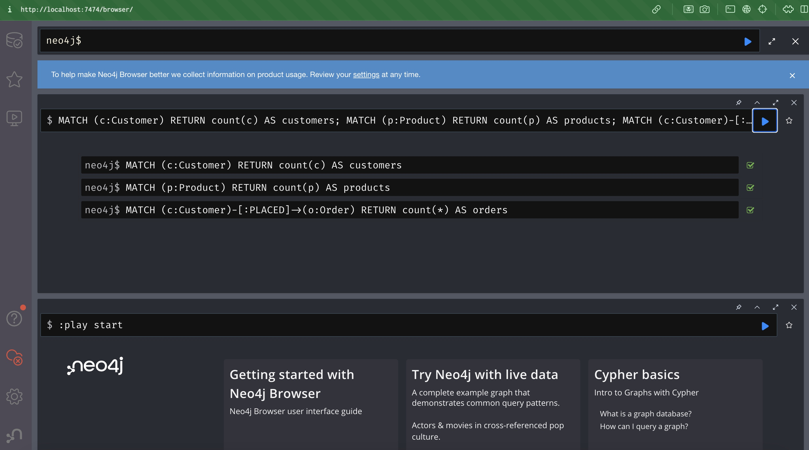
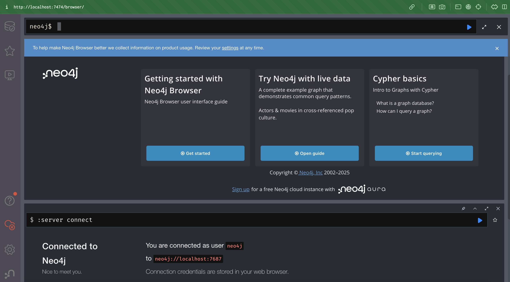
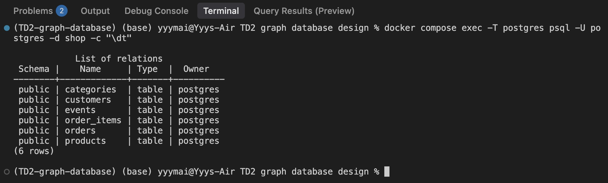

# Deliverables
## Screenshot of Neo4j Browser showing:
Constraints
At least 3 queries with output





## Output of:
```bash
curl "http://localhost:8000/health"
```


## Short note:
1) Quick Take on Recs and Going Production
What kind of recommendation trick can you pull off here?
Since the project is about Customers, Products, and those interaction events like views and clicks, the main thing we can do is Collaborative Filtering. Wwe can easily figure out which products people are checking out together (Item-Item CF) by using Neo4j's graph algorithms like co-occurrence and similarity, like Jaccard or cosine similarity. Then we could run PageRank to see which products are the most popular overall and recommend those as a starting point.

2) If you wanted to make this mini-project ready for a real company, what would you change?
To take this from a cool project to a real system, the first thing is stop reloading all the data every time. I should set up incremental ETL, only grabbing the new stuff from Postgres so the data loads way faster. We should also separate the data loading process from the app itself and put in a cache before the FastAPI app to serve those recommendations super quick without always hitting Neo4j.